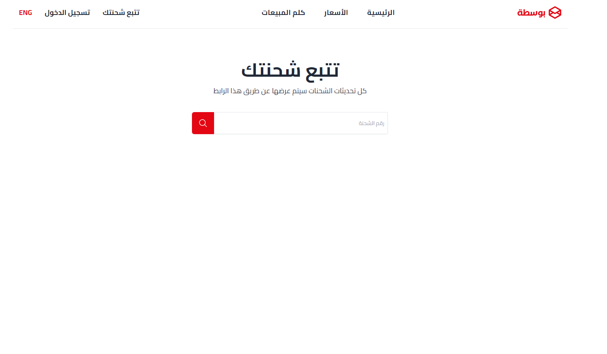
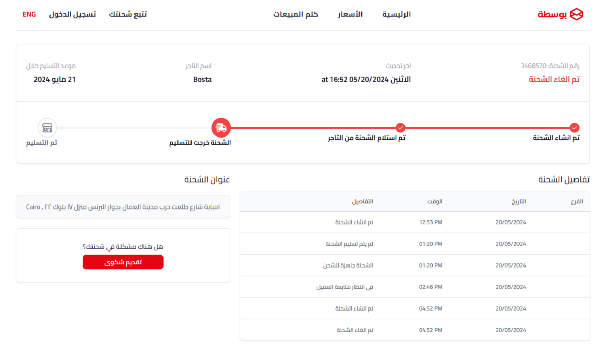
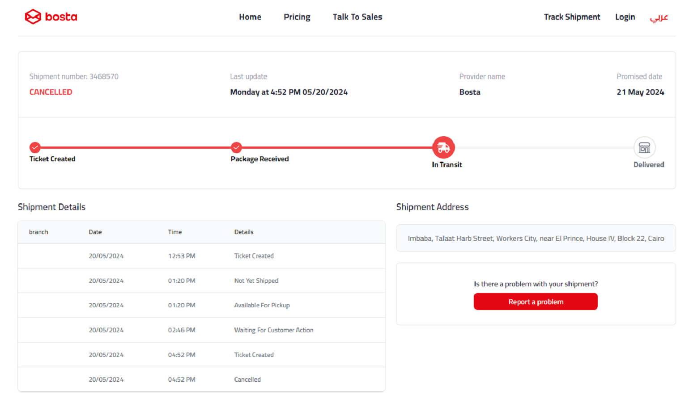
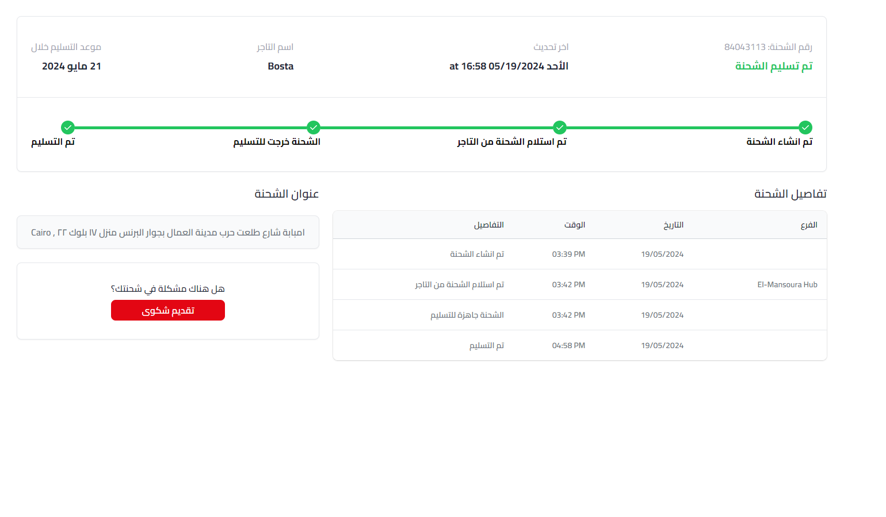

<br />
<div align="center">
  
  <h3 align="center">Bosta App</h3>

  <p align="center">
   Simple App where users can track their shipments built with React and Tailwind CSS
    <br />
</div>

  <details>
  <summary>Table of Contents</summary>
  <ol>
    <li>
      <a href="#about-the-project">About The Project</a>
    </li>
    <li>
      <a href="#screen-shots">Screen Shots</a>
    </li> 
    <li>
      <a href="#limitations">Limitations</a>
    </li>
    <li>
      <a href="#possible-improvements">Possible Improvements</a>
    </li>
    <li>
      <a href="#built-with">Built With</a>
    </li>
    <li>
      <a href="#getting-started">Getting Started</a>
      <ul>
        <li><a href="#prerequisites">Prerequisites</a></li>
        <li><a href="#installation">Installation</a></li>
      </ul>
    </li>
    <li><a href="#contact">Contact</a></li>
  </ol>
</details>

## About The Project



- User can track their shipment
- Website is responsive
- Website supports english and arabic languages
- Utilized React Router for routing
- Utilized React Router new Loader function as a way to fetch data and pass it down to children, it's behave like context api
- Build Error Screen to handle invalid tracking number

## Screen Shots





## Limitations

- Tracking shipments only handle three states delivered, cancelled and not delivered yet
- The Shipment Summary Steps only handles the status above due to API limitations.
- Translation made locally using react-i18next
  and couldn't translate not pre defined values

## Possible Improvements

- Utilize Google Translate API for translation of not pre defined values
- Improve The Shipment Summary Steps and make it dynamically display the current status flow
- Utilize React Router to apply localization in url

## Built With


## Getting Started

### Prerequisites

- Node.js
- npm or pnpm

### Installation

1. Clone the repo
   ```sh
   git clone https://github.com/Elalfy74/bosta-task
   ```
2. Navigate to the repo directory
   ```sh
   cd bosta-task
   ```
3. Install NPM packages
   ```sh
   npm i
   ```
4. Rename 'env.example' to 'env'
5. Configure .env Variables
   replace default values with your own
6. Start the project
   ```sh
   npm run dev
   ```

## Contact

Mahmoud Elalfy - [@Mahmoudelalfy74](https://twitter.com/Mahmoudelalfy74) -
[@Portfolio](https://mahmoud-elalfy.vercel.app/) -
[@LinkedIn](https://www.linkedin.com/in/mahmoud-elalfy-79b894209/)

Project Link: [Bosta Task](https://github.com/Elalfy74/bosta-task)
